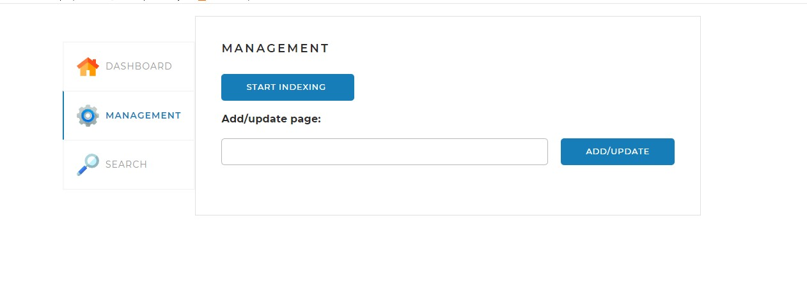

# SearchEngine
Данный проект реализует поисковый движок, предоставляющий пользователю специальный
API со следующими основными функциями: 
<li>предварительное индексирование сайтов;</li>
<li>поиск ключевых слов в проиндексированных сайтах и предоставление их пользователю.</li>

## Веб-страница

В проект также входит веб-страница, которая позволяет управлять процессами, реализованными
в движке.

Страница содержит четыре вкладки.

### Вкладка Please sign in

Эта вкладка открывается по умолчанию.
Здесь нужно ввести логин и пароль. По умолчанию логин: admin. 
Пароль: admin.

### Вкладка DASHBOARD

На этой вкладке
отображается общая статистика по всем проиндексированным сайтам, а также
детальная статистика и статус по каждому из сайтов (статистика,
получаемая по запросу <i>/statistics</i>).

### Вкладка MANAGEMENT

На этой вкладке находятся инструменты управления 
поисковым движком — запуск (запрос <i>/startIndexing</i>) 
и остановка (запрос <i>/stopIndexing</i>) полной индексации
(переиндексации), а также возможность добавить (обновить)
отдельную страницу по ссылке (запрос <i>/indexPage/{pagePath}</i>).
Отметим, что если в последнем запросе присутствует только
URL сайта без завершающего слэша (/), как в приведённом выше
скриншоте, то индексироваться будет указанный сайт целиком.

### Вкладка SEARCH

Эта вкладка предназначена для тестирования поискового
движка. На ней находится поле поиска и выпадающий список с
выбором сайта, по которому искать, а при нажатии на кнопку
<i>SEARCH</i> выводятся результаты поиска (по запросу /search).

## Файлы настройки
Данное приложение по выбору может работать с MySql Workbench. Если 
на вашем компьютере не установлена данная база данных, вы можете установить
её воспользовавшись инструкциями.
https://www.google.com/url?q=https://skillbox-manuals.github.io/manuals/&sa=D&source=docs&ust=1687285005959605&usg=AOvVaw1sxwotWzlv_c2NQnyPsC1V
Создайте пользователя для подключения к базе данных. Это может быть пользователь root, который имеет доступ ко всем базам данных (создаётся при установке MySQL-сервера), а может быть отдельный пользователь, имеющий доступ только к созданной вами базе данных, на ваше усмотрение.
Что бы поменять пользователя и пароль для подключения к базе данных 
измените данные в файле application.yaml. 

Где user это ваш логин а password это ваш пароль.

## Используемые технологии
Приложение построено на платформе <i>Spring Boot</i>.

Необходимые компоненты собираются с помощью фреймворка Maven.
Для загрузки и разбора страниц с сайтов используется библиотека <i>jsoup</i>.

Данная версия программы работает с СУБД MySQL. Для этого 
подключается зависимость <i>hibernate</i> и <i>mysql</i>.

Для удобства написания (и чтения) программного кода и для
расширения функциональности языка Java используется библиотека
Lombok (зависимость <i>lombok</i>).
Для диспользования лемматизации подключается зависимость <i>apache.lucene</i>

## Запуск программы
Репозиторий с приложением SearchEngine находится по адресу
[https://github.com/IvanApara/search-engine](https://github.com/IvanApara/search-engine).

Если проект загрузить на локальный диск, то он готов к тому,
чтобы его можно было скомпилировать и запустить с помощью среды
разработки IntelliJ IDEA.

